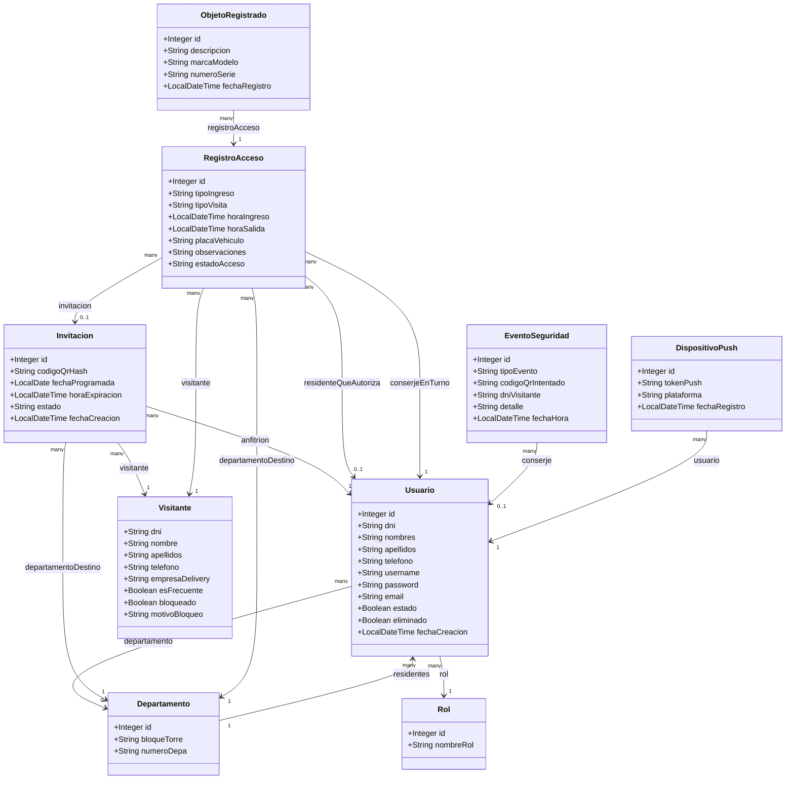
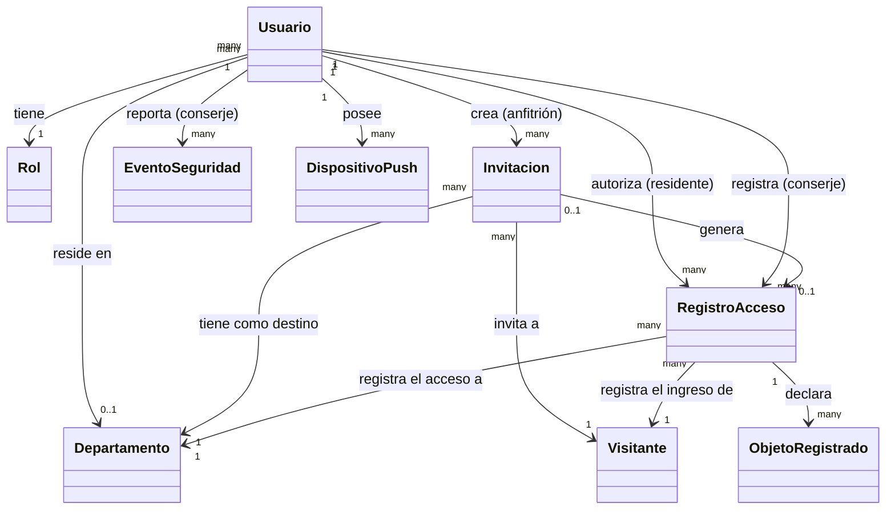

# Diagrama de Clases - Modelo de Dominio (api-backend)

## Versión de negocio (asociaciones con verbos)

Misma estructura, pero con las relaciones nombradas según la acción que representan en el dominio (más legible para personas no técnicas):

Cada relación se lee en el sentido de la flecha, sujeto → verbo → objeto:
- Un Usuario tiene un Rol.
- Un Usuario reside en un Departamento.
- Un Usuario (anfitrión) crea muchas Invitaciones.
- Una Invitación invita a un Visitante.
- Una Invitación tiene como destino un Departamento.
- Un RegistroAcceso registra el ingreso de un Visitante.
- Un RegistroAcceso registra el acceso a un Departamento.
- Un Usuario (residente) autoriza muchos RegistroAcceso.
- Un Usuario (conserje) registra muchos RegistroAcceso.
- Una Invitación genera (opcionalmente) un RegistroAcceso.
- Un RegistroAcceso declara muchos ObjetoRegistrado.
- Un Usuario (conserje) reporta muchos EventoSeguridad.
- Un Usuario posee muchos DispositivoPush.
