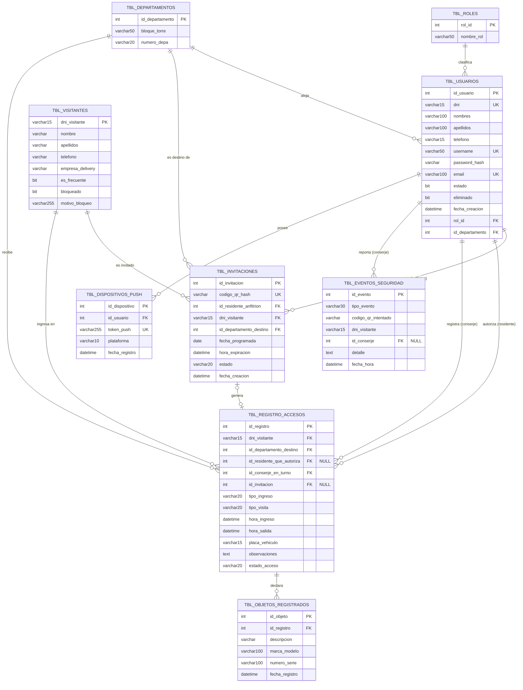

# Diseño Lógico de la Base de Datos (api-backend)

Modelo derivado de las entidades JPA en `api-backend/src/main/java/com/losrobles/api/models`.

## Diagrama Entidad-Relación

## Catálogo de tablas

### tbl_roles
| Columna | Tipo | Restricción |
|---|---|---|
| rol_id | INT | PK, IDENTITY |
| nombre_rol | VARCHAR(50) | NOT NULL |

### tbl_departamentos
| Columna | Tipo | Restricción |
|---|---|---|
| id_departamento | INT | PK, IDENTITY |
| bloque_torre | VARCHAR(50) | |
| numero_depa | VARCHAR(20) | |

### tbl_usuarios
| Columna | Tipo | Restricción |
|---|---|---|
| id_usuario | INT | PK, IDENTITY |
| dni | VARCHAR(15) | NOT NULL, UNIQUE |
| nombres | VARCHAR(100) | NOT NULL |
| apellidos | VARCHAR(100) | NOT NULL |
| telefono | VARCHAR(15) | |
| username | VARCHAR(50) | NOT NULL, UNIQUE |
| password_hash | VARCHAR | NOT NULL |
| email | VARCHAR(100) | UNIQUE |
| estado | BIT | DEFAULT 1 |
| eliminado | BIT | DEFAULT 0 (soft delete / anonimización) |
| fecha_creacion | DATETIME | NOT NULL |
| rol_id | INT | FK -> tbl_roles.rol_id |
| id_departamento | INT | FK -> tbl_departamentos.id_departamento, NULL |

### tbl_visitantes
| Columna | Tipo | Restricción |
|---|---|---|
| dni_visitante | VARCHAR(15) | PK |
| nombre | VARCHAR | |
| apellidos | VARCHAR | |
| telefono | VARCHAR | |
| empresa_delivery | VARCHAR | |
| es_frecuente | BIT | DEFAULT 0 |
| bloqueado | BIT | NOT NULL, DEFAULT 0 |
| motivo_bloqueo | VARCHAR(255) | |

### tbl_invitaciones
| Columna | Tipo | Restricción |
|---|---|---|
| id_invitacion | INT | PK, IDENTITY |
| codigo_qr_hash | VARCHAR | NOT NULL, UNIQUE |
| id_residente_anfitrion | INT | FK -> tbl_usuarios.id_usuario, NOT NULL |
| dni_visitante | VARCHAR(15) | FK -> tbl_visitantes.dni_visitante, NOT NULL |
| id_departamento_destino | INT | FK -> tbl_departamentos.id_departamento, NOT NULL |
| fecha_programada | DATE | NOT NULL |
| hora_expiracion | DATETIME | |
| estado | VARCHAR(20) | DEFAULT 'PENDIENTE' |
| fecha_creacion | DATETIME | NOT NULL (auditoría automática) |

### tbl_registro_accesos
| Columna | Tipo | Restricción |
|---|---|---|
| id_registro | INT | PK, IDENTITY |
| dni_visitante | VARCHAR(15) | FK -> tbl_visitantes.dni_visitante, NOT NULL |
| id_departamento_destino | INT | FK -> tbl_departamentos.id_departamento, NOT NULL |
| id_residente_que_autoriza | INT | FK -> tbl_usuarios.id_usuario, NULL |
| id_conserje_en_turno | INT | FK -> tbl_usuarios.id_usuario, NOT NULL |
| id_invitacion | INT | FK -> tbl_invitaciones.id_invitacion, NULL |
| tipo_ingreso | VARCHAR(20) | NOT NULL ("QR", "MANUAL", "VEHICULAR") |
| tipo_visita | VARCHAR(20) | ("NORMAL", "FRECUENTE", "DELIVERY") |
| hora_ingreso | DATETIME | NOT NULL |
| hora_salida | DATETIME | NULL |
| placa_vehiculo | VARCHAR(15) | |
| observaciones | TEXT | |
| estado_acceso | VARCHAR(20) | DEFAULT 'ACTIVO' ("ACTIVO", "FINALIZADO") |

### tbl_objetos_registrados
| Columna | Tipo | Restricción |
|---|---|---|
| id_objeto | INT | PK, IDENTITY |
| id_registro | INT | FK -> tbl_registro_accesos.id_registro, NOT NULL |
| descripcion | VARCHAR | NOT NULL |
| marca_modelo | VARCHAR(100) | |
| numero_serie | VARCHAR(100) | |
| fecha_registro | DATETIME | NOT NULL |

### tbl_eventos_seguridad
| Columna | Tipo | Restricción |
|---|---|---|
| id_evento | INT | PK, IDENTITY |
| tipo_evento | VARCHAR(30) | NOT NULL ("QR_INVALIDO", "QR_EXPIRADO", "QR_YA_USADO", "VISITANTE_BLOQUEADO", "RESIDENTE_NO_VINCULADO") |
| codigo_qr_intentado | VARCHAR | |
| dni_visitante | VARCHAR(15) | (no es FK, solo referencia textual) |
| id_conserje | INT | FK -> tbl_usuarios.id_usuario, NULL |
| detalle | TEXT | |
| fecha_hora | DATETIME | NOT NULL |

### tbl_dispositivos_push
| Columna | Tipo | Restricción |
|---|---|---|
| id_dispositivo | INT | PK, IDENTITY |
| id_usuario | INT | FK -> tbl_usuarios.id_usuario, NOT NULL |
| token_push | VARCHAR(255) | NOT NULL, UNIQUE |
| plataforma | VARCHAR(10) | "ANDROID" / "IOS" |
| fecha_registro | DATETIME | NOT NULL |

## Notas de diseño

- **tbl_usuarios** centraliza residentes, conserjes y administradores; el rol determina el comportamiento vía `rol_id`.
- **Soft delete**: las cuentas de usuario no se borran físicamente (`eliminado = 1`) para preservar la integridad referencial del historial (accesos, invitaciones, eventos, dispositivos push).
- **tbl_invitaciones** ↔ **tbl_registro_accesos** es una relación opcional 1 a 1: una invitación puede generar un registro de acceso (ingreso por QR), pero un registro también puede crearse sin invitación (ingreso manual/vehicular).
- **tbl_eventos_seguridad** guarda `dni_visitante` como dato textual (no FK) porque registra intentos fallidos donde el visitante puede no existir en `tbl_visitantes`.
